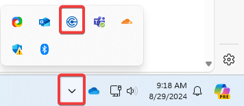

# 👩‍💻 Sophos Connect VPN

This guide will demonstrate how to use the Sophos Connect VPN client to connect to your remote workforce. You might need this article if you are unable to connect to a file server or Remote Applications.&#x20;

1. Launch the Sophos Connect software from the start menu/the desktop/or the task bar (near the time, at the bottom right-hand corner by default You might need to click the arrow to show all applications.)\
    (1) (1) (1) (1).png>) 
2. Once in the application, you should see your company's remote connection listed. Click Connect.\
    (1) (1) (1) (1) (1) (1).png>)
3. If needed, input your user name and password. If required, and you're not sure what your user name and password are, [contact eTop](../../../etop-tools/welcome-to-working-with-etop/). \
    (1) (1) (1) (1) (1).png>)

## How to troubleshoot Sophos Connect VPN

If your computer disconnects from the internet, goes to sleep, or is first signing in, you might not be connected to the VPN. Here's how to tell.

1. If Sophos Connect has connected, it will show a green dot in the taskbar icon  .png>) and a green check mark in the application (with the option to Disconnect)\
   .png>)
2. If Sophos Connect is disconnected or failed to connect, it will show a red dot in the taskbar icon .png>) and the option to Connect in the application. \
   .png>)\
   Click Connect and enter your user name and password (usually first initial last name with your computer password) and you will be back up and running.\
