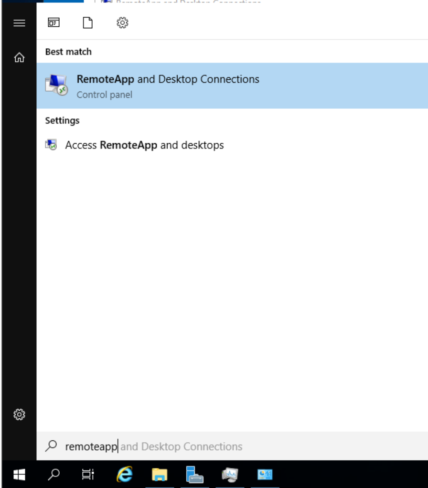
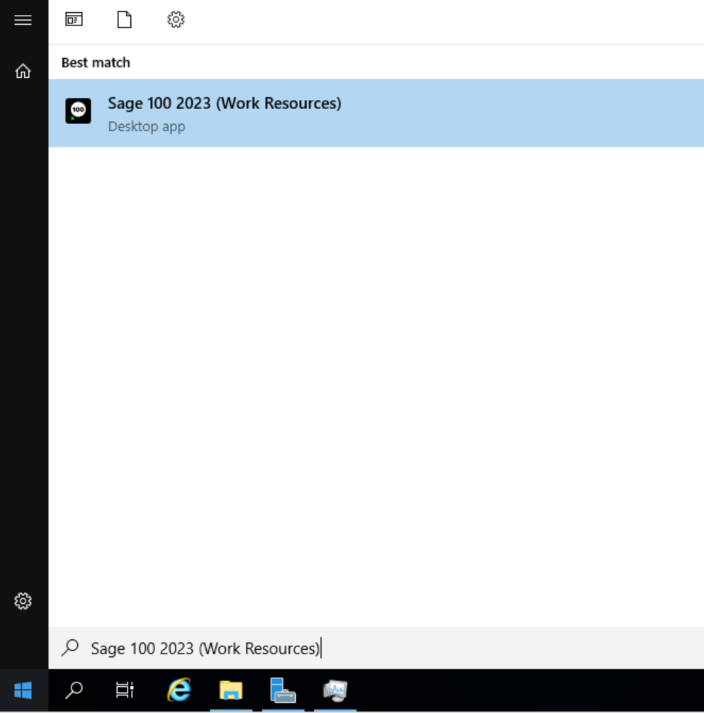

# 🛣️ Remote Applications

If your organization uses RemoteApps, or applications published and run on a remote server, then you may occasionally need to update the applications. This article describes how to refresh the list of remote applications, which needs to be done if there are new applications or updates to existing applications.

There are two (2) ways to refresh remote applications on a Windows desktop. You can either wait - the applications are refreshed every 24 hours - or refresh manually.

## How will I know if my application is a RemoteApp?

Your application will be called "Applicationname (Remote Workspaces)" It will also appear under "RemoteApp and Desktop Connections" in your Start menu

## Steps to Refresh RemoteApps Manually

1. Click Start, and type "RemoteApp" to search for "RemoteApp and Desktop Connections"\
   Select "RemoteApp and Desktop Connection"\
   
2. In the window that opens, select "View Details"\
   
3. In this window, you can see when the most recent update occured. To update immediately, click "Update Now"\
   .png>)
4. You will receive a window that looks like this. (note: the number of programs and/or desktops will depend on your organization's configuration)\
   .png>)
5. You can view the applications either by clicking View Resources in the first window, or under the start menu.\
   .png>)\
   
